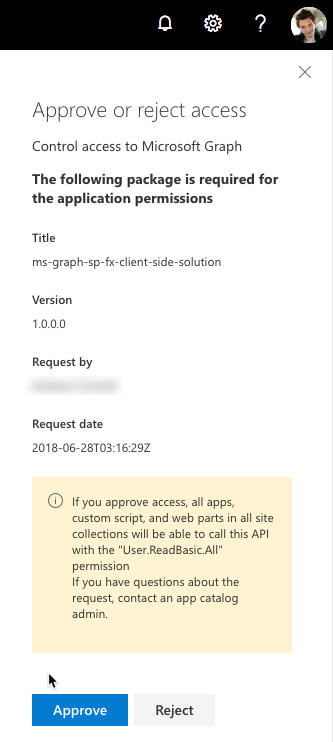

# Demo: Show profile details from Microsoft Graph in SPFx client-side web part

In this demo you will show a new SPFx project with a single client-side web part that uses React, [Fabric React](https://developer.microsoft.com/fabric) and the Microsoft Graph to display the currently logged in user's personal details in a familiar office [Persona](https://developer.microsoft.com/fabric#/components/persona) card.

## Running the demo

1. Open a command prompt and change directory to the root of the application.
1. Execute the following command to download all necessary dependencies

    ```shell
    npm instal
    ```

1. Create the SharePoint package for deployment:
    1. Build the solution by executing the following on the command line:

        ```shell
        gulp build
        ```

    1. Bundle the solution by executing the following on the command line:

        ```shell
        gulp bundle --ship
        ```

    1. Package the solution by executing the following on the command line:

        ```shell
        gulp package-solution --ship
        ```

1. Deploy and trust the SharePoint package:
    1. In the browser, navigate to your SharePoint Online Tenant App Catalog.

        >Note: Creation of the Tenant App Catalog site is one of the steps in the **[Getting Started > Set up Office 365 Tenant](https://docs.microsoft.com/sharepoint/dev/spfx/set-up-your-developer-tenant)** setup documentation.

    1. Select the **Apps for SharePoint** link in the navigation:

        

    1. Drag the generated SharePoint package from **\sharepoint\solution\ms-graph-sp-fx.sppkg** into the **Apps for SharePoint** library.
    1. In the **Do you trust ms-graph-sp-fx-client-side-solution?** dialog, select **Deploy**.

        

1. Approve the API permission request:
    1. Navigate to the SharePoint Admin Portal located at **https://{{REPLACE_WITH_YOUR_TENANTID}}-admin.sharepoint.com/_layouts/15/online/AdminHome.aspx**, replacing the domain with your SharePoint Online's administration tenant URL.

        >Note: At the time of writing, this feature is only in the SharePoint Online preview portal.

    1. In the navigation, select **Advanced > API Management**:

        

    1. Select the **Pending approval** for the **Microsoft Graph** permission **User.ReadBasic.ALL**.

        

    1. Select the **Approve or Reject** button, followed by selecting **Approve**.

        

1. Test the web part
    1. In the command prompt for the project, execute the following command to start the local web server:

        ```shell
        gulp serve --nobrowser
        ```

    1. In a browser, navigate to one of your SharePoint Online site's hosted workbench located at **/_layouts/15/workbench.aspx**
    1. In the browser, select the Web part icon button to open the list of available web parts:

        

    1. Locate the **GraphPersona** web part and select it

        

    1. When the page loads, notice after a brief delay, it will display the current user's details on the Persona card:

        
